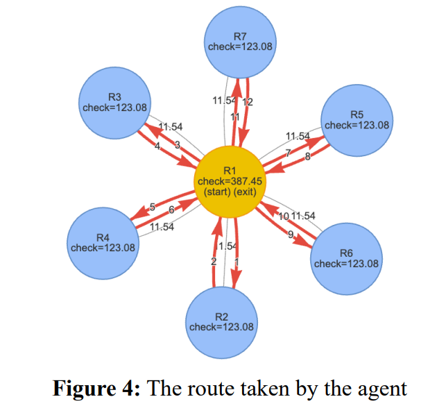

# Model Choosing
First of all, I want to mention that your team is not necessarily to build model which outputs the correct answer. The requirement of the problem is only to 'evaluate' or 'predict' something, so it is acceptable to start with a very simple model at very beginning. I prefer starting with a simple model as the baseline since it has great potential for optimization or combination with other models. In contrast, using a more complex model may produce results closer to the correct answer, but it comes with higher risks of failure, requires extensive testing, and demands more detailed explanations in the report.

Let's having a look at the [2025 problem A](./problem/2025_HiMCM_Problem_A.pdf).

This problem asked us to optimize sweeping strategies in multi-floor buildings during emergency evacuations. We have to ensure all rooms are cleared in the shortest possible time, while prioritizing occupant safety and responder efficiency. 
First, I would like to share the model our team have built. Each room is abstracted as a node and the hallway connecting two room was represented as an edge. The weights of edges corresponds to the time required to travel between two rooms.

 So, this problem is converted into a graph theory search problem. The next thing is to find some methods to get the routes sweeping all the rooms. We implement four algorithms: greedy, global optimal(brute-force), nearest neighbor and slowest first. So far, a simple model is built. What's next is to find the weakness and determine how to improve this model or integrate with other approaches. In order to improve realism, We developed an ABM(Agent-Based Model) that simulates the sweeping process in different types of rooms and output more accurate time. These outputs are taken as the inputs for previous graph theory model. Our final model is a big simulation model which also takes ABM but it is an independent model to the previous model. This sort of model is called extend model. 

Let's see a very different method taken by other team(*Team #16497*). They use a machine learning technique called RL(Reinforce Learning). That is really clever since this method could discover the most optimal route for every scenario. This is because the RL runs thousands of simulations for each input scenario. During training, the agent receives rewards for efficient actions and penalties for inefficient ones. It will learn a strategy that maximizes the total reward or achieve other goal like few steps. Here is one paragraph they justify why RL is chosen.

>The emergency evacuation sweep problem can be naturally formulated as a graph traversal
problem where: (1) Nodes represent rooms and hallways, (2) Edges represent possible
movement paths, (3) Goal is to visit all nodes in minimum time. However, traditional graph algorithms (like Dijkstra's or A*) are not directly applicable because:
**1** The cost function is complex (not just distance, but also clearance time)
**2** We need to coordinate multiple agents (two-person teams with other teams in complex
scenarios)
**3** The optimal strategy depends on the graph structure (GNN helps generalize)
RL offers several advantages, including **(1)** learning from experience, where the agent discovers strategies through trial and error, **(2)** can handle the complexity of multi-objective problems, and **(3)** GNN architecture allows the model to work on different floor plans.

However, unfortunately, they fail to apply this method to more complex scenarios. As a result, they eventually incorporated an Agent-Based Model (ABM) to simulate fire spread and responder movement. They came very close to producing the real-world optimal solution. If we were to further develop this approach, one possible improvement would be to expose the RL agent to increasingly complex and scaled-up environments during training. For example, the agent could be trained using procedurally generated floor plans and dynamic hazards like the spread of fire and smoke. Maybe we could design scenarios which are difficult to handle using traditional search algorithms like A* or ABM. Let's take some analysis for these algorithms. A* algorithm performs best in the static and known maze.(I would called the sweeping building as maze later.) However, when we go further in this problem, we would found that fire and smoke would spread which extremely affects the strategy of sweeping. While ABM could better capture real-world dynamics, it requires more computation since decisions are made for each step. As a result, ABM is struggling to scale up to very large maze.

In summary, no single model is universally optimal. Each algorithm has its own strengths and limitations, which become apparent under different problem settings. Rather than searching for a perfect model, a more effective strategy is to identify the problem characteristics and introduce reasonable assumptions to specialize the scenario. By doing so, the chosen model could operate within conditions that highlight its advantages, while its weaknesses become less influential. 