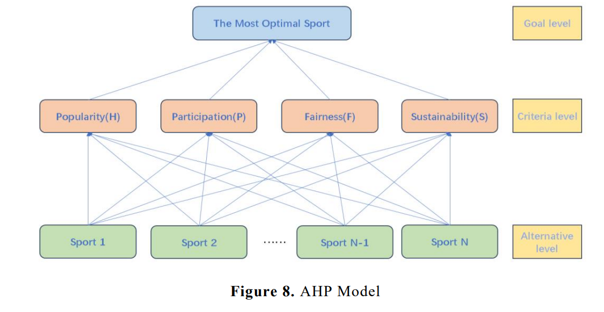

# Additional Concepts

### Confusion Matrix
Accuracy alone is often insufficient to evaluate a classification model, especially when the dataset is imbalanced or when different types of errors have different consequences. To better understand how predictions differ from ground truth, we introduce the confusion matrix. The confusion matrix is a common tool used to compare a model’s predictions with the actual outcomes, shown as follow.
|                        |Positive (Prediction)| Negative     |
|------------------------|---------------------|--------------|
|**Positive (Reference)**|True Positive        |False Negative|
|**Negative**            |False Positive       |True Negative |

It is easy to understand the table. Take *False Negative(FN)* as an example, this occurs when the actual condition is positive, but the model incorrectly predicts it as negative. When improving a model, a common optimization goal is to maximize accuracy. However, depending on the scenario, other metrics such as **Recall** and **Precision** can also be used to guide optimization.
It is hard to use language to express the real meaning of them. I show them in math formulae:

$$ Precision=\frac{TP}{TP+FP} \qquad  Recall=\frac{TP}{TP+FN} $$

**Precision** represents how many results are predicted to be positive where the labels are positive. And **recall** refers to how many results are predicted to be positive for all the positive labeled samples. Here, there must be some confusion. In precision, "labels are positive" means the prediction result is positive. In recall, "positive labeled samples" means the reference result is positive. The distinction can be confusing at first, but it becomes clear when you refer to the confusion matrix above.

Now, let's see how accuracy is calculated and you will know what is the difference between these indicators.
$$Accuracy=\frac{TP+TN}{TP+TN+FP+FN}$$
Unlike precision and recall, which focus primarily on true positive cases, accuracy
optimizes both true positives (TP) and true negatives (TN). As a result, its value can
be dominated by the majority class.

Considering a medical diagnose task where only 1% of patients has the certain disease. Since accuracy optimize both TP and TN, it is easy for the model to fail to predict 1% of patient who actually has disease and achieve 99% accuracy by returning all patients are healthy. Therefore, accuracy alone fails to reflect the model’s ability to detect positive cases.

In several cases where failing predicting positive cases are costly, such as emergency prediction or disease detection ,recall and precision become more informative and should be prioritized.

### Data processing
In previous chapter "writing methodology", I have mentioned a common paradigm of data processing: data washing-- identify patterns -- feature engineering --choosing model. In this section, we briefly introduce several useful techniques that can be applied in these steps.

#### Handling Missing Values
🚧
Missing values commonly occur in real-world datasets due to certain reasons. In order to apply a suitable model on this dataset, we firstly need to fill the gaps. Although this step could be resolved by AI assistant, I highly recommend you to understand the basic principle of it. Mode, median and mean are the commonly used indicators. Let's see where they should be used in [this table](./table/1.csv).

**Mean** and **median** filling are mainly used for numerical features. However, some caution is required. For columns such as *Food Court* and *ShoppingMall* in this table, where values vary significantly and a large number of entries are zero, mean filling is not a good choice, since a few extreme values may distort the result. In such cases, median filling is more robust. On the other hand, for features like *age*, which usually follow normal distribution or other distribution, mean filling usually works well and preserves the overall data distribution. **Mode filling** is mainly used for categorical features, such as *Destination*, *Cabin*, or *Cryosleep*. Let’s first look at *Destination* and *Cabin*. These features are pure categories and applying mean or median filling is meaningless, even if these categories have been quantized. (Quantization is a very important concept and I will introduce it later.) Numerical operations do not carry semantic meaning for categorical data. Features like *Cryosleep* are boolean values meaning they only take two values (*True or False*). For this reason, mean filling may produce a real number, which has no practical interpretation. Although median filling method may return a valid value within the column, it is still not appropriate since the ordering of boolean value does not reflect significance and it is not representative enough. 

#### Orthogonal decomposition

In many cases, highly correlated (no matter positively or negatively) features often lead to unstable models and redundant information. One effective way to address this issue is to transform the original features into a new set of **orthogonal (uncorrelated) features** through linear transformations. This idea is widely used in feature engineering, especially in methods such as Principal Component Analysis (PCA).

Suppose we have a dataset with $m$ features and $n$ observations. To implement PCA, the data can be represented as a matrix $ X \in \mathbb{R}^{n \times m} $, where each row corresponds to one observation and each column corresponds to one feature.

The first step of PCA is **centering** the data. This is done by subtracting the mean of each feature from the original matrix:
$$\bar X = X - \mathrm{mean}(X)$$
where $ \mathrm{mean}(X) $ denotes the vector of column-wise means.

Next, the covariance matrix of the centered data is computed:

$$\mathrm{Cov}(\bar X) = \frac{1}{n} \bar X^T \bar X$$

where $\bar X^T$ denotes the transpose of $\bar X$. In some literature, the covariance matrix is also denoted by $\Sigma$.

The principal components are obtained by performing eigenvalue decomposition
on the covariance matrix:

$$\mathrm{Cov}(\bar X)\, v_i = \lambda_i v_i$$

where $\lambda_i$ is the eigenvalue corresponding to the eigenvector $v_i$. Each eigenvector represents a direction in feature space, and its eigenvalue indicates the amount of variance captured along that direction.

All eigenvectors $v_i$ form an orthogonal matrix $V$. The final step is to project the centered data onto these orthogonal directions, resulting in a new feature matrix:

$$Z = \bar X V$$

The matrix $Z$ contains the transformed features, which are mutually uncorrelated and ordered by their explained variance.

Although PCA is not commonly used in modern machine learning pipelines since many tree-based models and deep learning models could implicitly handle feature correlations, it becomes powerful when dimensionality reduction is required. In particular,PCA is useful when we want to reduce the dimension space from $m$ dimension to $k$ dimension where $m>k$. In simple terms, we apply this method when we want to have only $k$ features whereas we have $m$ observed features in the original dataset. In order to achieve this, we would have the similar process as normal PCA and what different is to select top $k$ features before the creation of the $V$ matrix. The number of retained components is typically determined by the explained variance ratio:

$$\frac{\sum_{i=1}^{k} \lambda _i}{\sum_{i=1}^{m} \lambda _i} \geq 95%$$

where $k$ denotes the number of retained components, $m$ is the total number of features, and $\lambda_i$ are the eigenvalues obtained from $\mathrm{Cov}(\bar X)\, v_i = \lambda_i v_i$.
### Common model
#### Analytic Hierarchy Process (AHP)
In this part, we introduce a high-level scoring method called *Analytic Hierarchy Process (AHP)*. This method allows the integration of multiple perspectives from different experts on various factors, and generates a consistent and comprehensive weight system for the scoring process. The following chart could clearly show the process of this method.

    

As for the detailed process, let's take the above charts as an example, we have four factors/criterion which determines the most optimal sport: H, P, F and S. Each expert may have different perspective to the importance of these criterions.For each matrix, diagonal elements are 1 (self-comparison), and off-diagonal elements are assigned values such as 3, 5, 7, 9 to indicate increasing importance, with reciprocals (1/3, 1/5, 1/7, 1/9) for the opposite direction. These matrices are combined to form the final comparing matrix by taking the geometric average, shown as following formula.

$$a_{i,j}^{combined}=(\prod_{k=1}^m \; a_{i,j}^k )^{1/m}$$

where $m$ represents the number of experts and k represents the index of the current expert whose score is being considered.

The following steps are normalization and weight calculation. Normalization is the process of converting the values in the comparison matrix to a common scale so that they can be meaningfully compared. Typically, each column in the matrix is divided by its column sum, so that the sum of each column equals 1. After that, averaging each row gives the relative weight of each criterion. After normalizing the combined matrix, the relative weight of each criterion is obtained by averaging the values in each row. These weights represent the overall importance of each criterion in the decision-making process.

