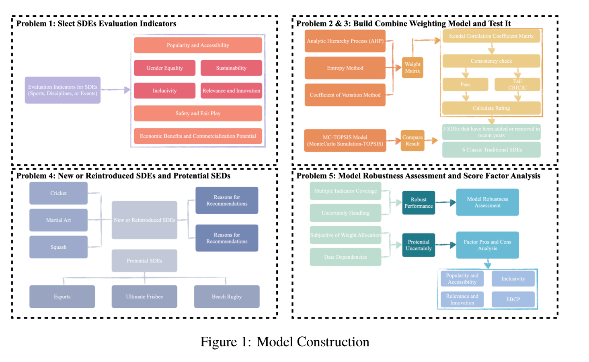
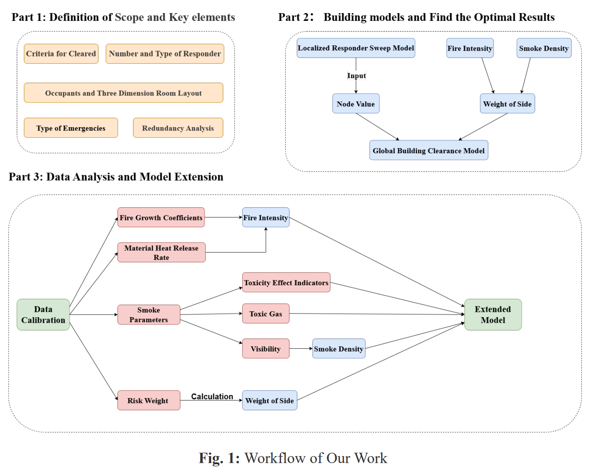
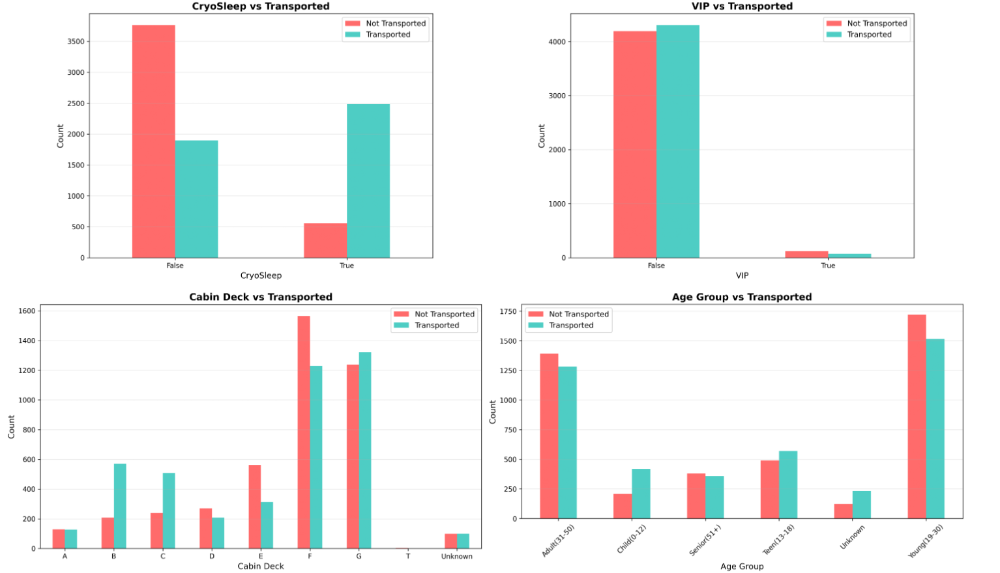
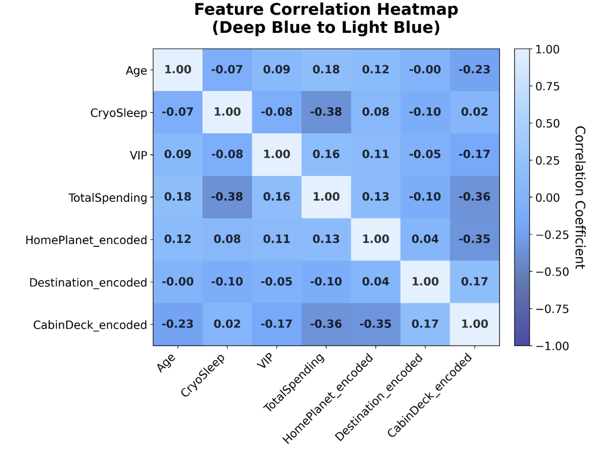
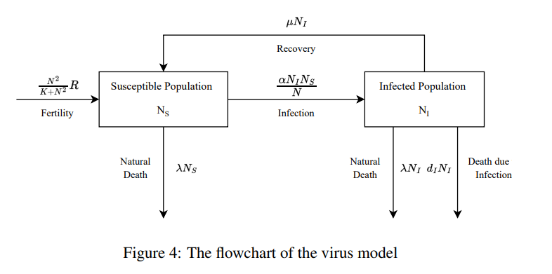
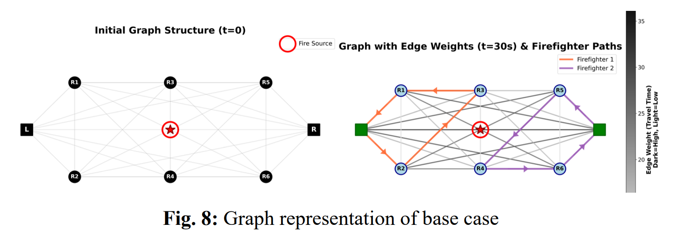
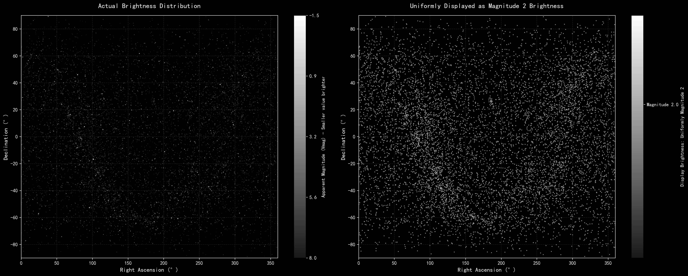
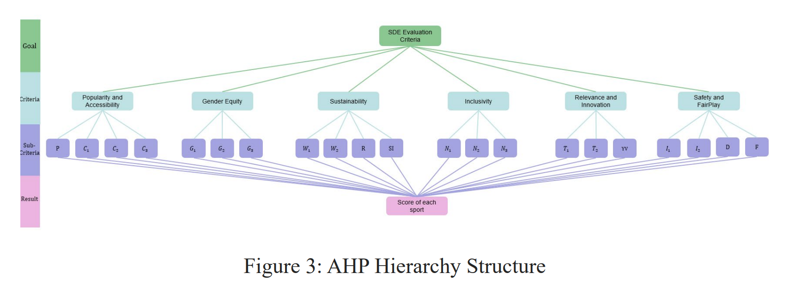
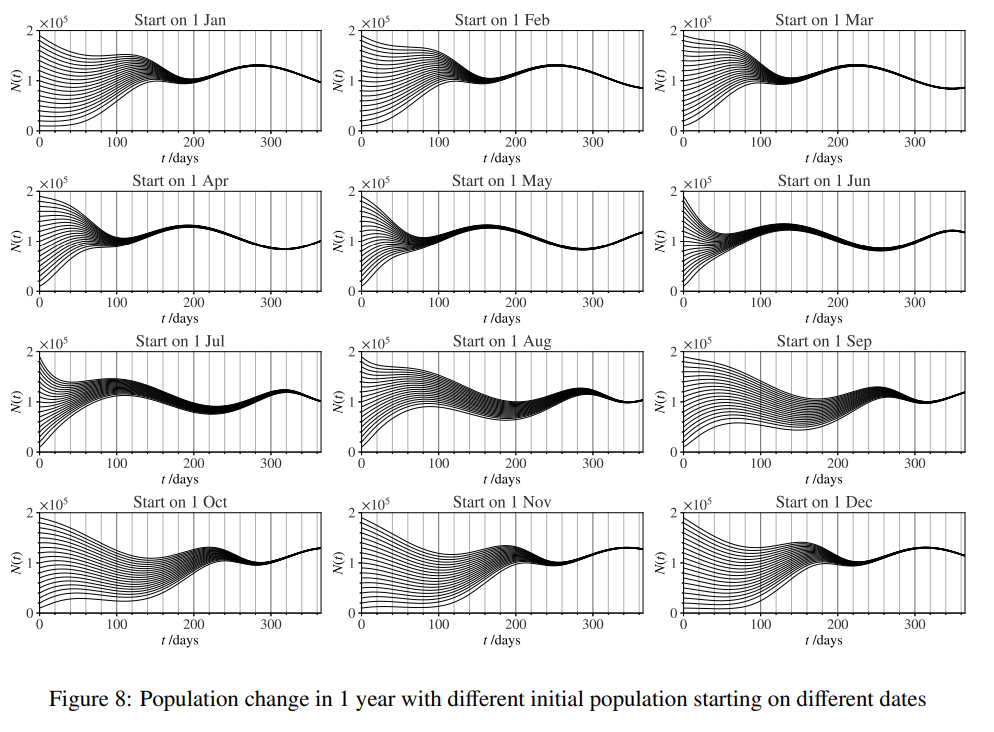
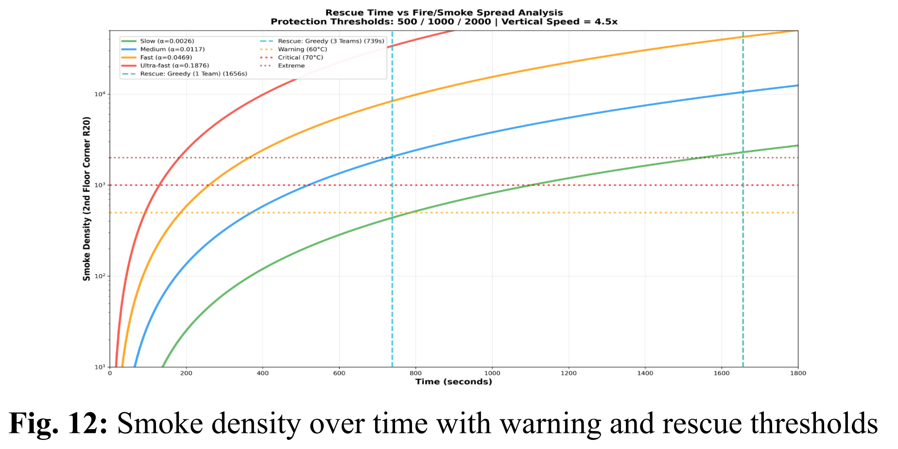

# Visualization
There is a very classic statement: if something could illustrate by the charts, you have better to use them instead of sentences. Since most of readers will find it difficult to follow the formula or the text, they will pay more attention to your charts or visualization. Also, text is not always powerful enough to show some slight or detailed change of models.
Since visualization is used throughout the report, I would share in the order of report.
Let's see a whole content from *Team #12821* for [2022 problem A](./problem/2022_HiMCM_Problem_A.pdf)
>**1 Introduction**
1.1 Background 
1.2 Restatement of Questions
1.3 Assumptions and Justifications
**2 Population model**
2.1 Variable
2.2 Baseline Model 
2.2.1 Model Setup
2.2.2 Allee effect
2.2.3 Critical and Maximum Sustainable Population
2.2.4 Parameter Calibration and Model Results
2.3 With Virus 
2.3.1 Model Setup
2.3.2 Parameter Calibration and Model Results
2.4 Seasonality
2.4.1 The Lifespan With Seasonal Change
2.4.2 The Fertility With Seasonal Change
2.4.3 Parameter Calibration and Model Results
**3 Sensitivity Analysis**
3.1 Baseline
3.2 Virus
3.3 Seasonality
3.4 Discussion
**4 Pollination Prediction**
4.1 Variables
4.2 Model
4.3 Values of Parameters
4.4 Number of hives for different crops 
4.5 Factors influencing foraging ability
4.5.1 Temperature
4.5.2 Air pollution
4.5.3 Use of pesticide
**5 Conclusion**
5.1 Strengths
5.2 Limitation
**Reference**

#### Introduction
This section has limited opportunities for visualization. The only thing we could do is to present our workflow, as shown below.

    

Many of people underestimate the value of this sort of visualization. A clear workflow chart not only helps readers understand how your model is constructed and the relationship between each modules but also makes it easier for your team to manage progress during competition. Here are few suggestions when creating this graph. I recommend using an online editor such as draw.io since it was downloaded with editable png files which is very convenient when revision is required. Besides, the size of the texts is crucial. If labels are too small to read without zooming, the chart will lose its purpose and occupies the valuable place in your report. 

#### Data Analysis and Calibration
In [writing methodology part](Writing%20Methodology.md), I illustrate the whole process of data analysis and calibration. When we want to observe the patterns between some features, histogram could demonstrate the patterns clearly as shown below. 

From the chart above, we could easily to observe one pattern: people who are cryosleeping have very high probability to be transported.

When we want to remove some features, the heat table should be shown to illustrate the relevance of two features. If the value of intersection point is very close to 1, two features are highly positive correlated and if they are close to -1, this means these two features are highly negative correlated. The positive one may amplify the effect of noise and the negative one may lead features partially cancel out each other.

#### Model Explanation
**Model Workflow** 
As shown in the following graph, the modeling process is illustrated using a workflow diagram similar to those introduced earlier. By observing the flowchart, all the complicated working is represented by the rectangles hiding detailed computations of model and shows the clear overall workflow with all relevant inputs and outputs.

    

**Your Model**
The visualization is to simplify or summarize your content. So, it doesn't follow a very strict sequential flow. The only thing is to help reader understand your model. Alternatively, some teams prefer to present their work using many equations. There is a [report](./report/14995.pdf) (*Team #14995*) for [2024 problem A](./problem/2024_HiMCM_Problem_A.pdf) which is filled with mathematical derivation. If you like derivation-style explanation, you could learn from this report. Everyone has his/her preferred style to illustrate the problem. Personally, I recommend the visualization since my math is not strong enough and visualization is clear for me.

Take some examples when illustrating your model:
[2025 problem A](./problem/2025_HiMCM_Problem_A.pdf) 
For this problem, our team first abstract the problem as a graph theory problem. Each room is abstracted as a node and the hallway connecting two room was represented as an edge. The weights of edges corresponds to the time required to travel between two rooms.The following graph illustrate how this method works.

[2026 IMMC problem](./problem/2026_IMMC_Problem_A.pdf) (This competition was taken place in 2025 autumn.)
If we want to explain why we choose cluster algorithm we could have a visualization of given data and add some advantages of it below the charts.  

>Since constellations are formed by connecting stars that are close to each other in space, stars that are geographically or feature-wise near one another naturally belong to the same group. Clustering algorithms follow the same principle by grouping nearby data points into clusters based on distance or similarity. Therefore, using clustering allows us to automatically identify groups of neighboring stars that align well with how constellations are defined.

[2024 problem A](./problem/2024_HiMCM_Problem_A.pdf)
From *Team #15926*
They use a method called AHP(Analytic Hierarchy Process) to give the weight of each factors. The structure is shown below. This could clearly illustrate what their model have done and the relationship between the current model and the final goal.

**Data Change**
Data change visualizations are often used to highlight trends, sensitivity, or the impact of key parameters. Rather than explaining the full mechanism of the model, these plots help readers quickly grasp what changes and why it matters.
Take some examples:
[2022 problem A](./problem/2022_HiMCM_Problem_A.pdf) 
From *Team #12821*

    

>*We display the graphs below to show how the starting date $(t_0)$ affected the initial population. Varied (t_0) results in different initial population values. Despite the population’s diverse starting positions, every graph has revealed a consistent, recognizable pattern. The curves with various starting dates are identical when translated horizontally. **The curves are the same regardless of starting dates or initial populations and have a periodicity of 365 days (or one year). This illustrates the stability and validity of our seasonality model.***

[2025 problem A](./problem/2025_HiMCM_Problem_A.pdf)
From our team (*Team #16985*)

    

>*With further analysis, we compared the rescue time of a single firefighting team with the smoke spread time corresponding to the human tolerance threshold. Two responders were generally able to complete the rescue under gradually developing fires but were unable to do so in more severe scenarios. **For intense fires with fast or ultra-fast α values, even three teams of responders could not complete the task in time. Since the fire was too intense to implement the rescue.***