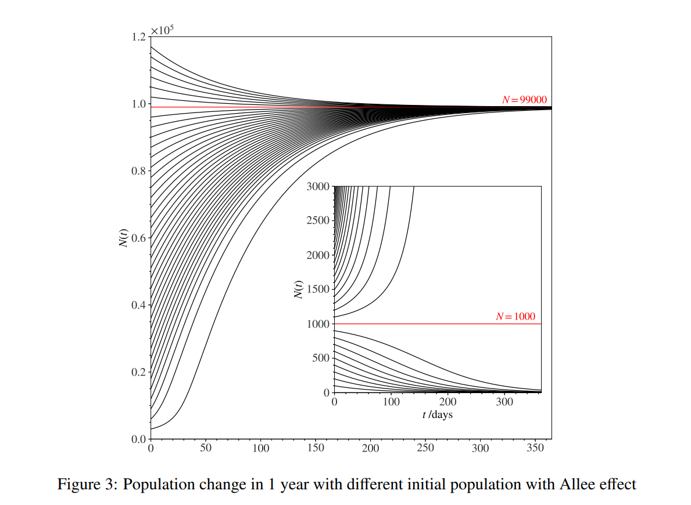

# Writing Methodology
1. Introduction
2. Model Explanation
3. Visualization
4. Sensitivity Analysis


### Introduction
**1.1 Background**
This part should *brief restate the problem* that posed by HIMCM. It should explain why problem is important and model is required. Also, you could give a brief conclusion of your model.
**1.2 Problem Restatement**
It seems to be similar to the Background part. But this part is asked you to fully list the *questions or tasks required by the problem*. It may include one question and a summary of related model.
**1.3 Assumption and Justification**
This section illustrate your assumptions while building the model. This because the model is theoretical which could not consider all the factor in the real world. 
Take an example: There is a problem about evacuation of firefighters in a building. If you want to simulate the behavior of them using a ABM (Agent-Based Model), you may ignore the destroy of construction of the building when rescuing. So, we have to write this in the assumption section and give a reason for why we ignore it. 

### Model Explanation
There are various ways to illustrate models but we have to illustrate with clear logics. More importantly, you have to justify why choose this model. It does not come from the chat boxes from GPT but from the data pattern and your understanding of different models. You have to know the trade-offs of your model and explain its advantages, acknowledge its limitations, and show how you optimize these weaknesses later to build a more robust solution.

**Case Study**
[2022 Problem A](./problem/2022_HiMCM_Problem_A.pdf)
I take one of the outstanding paper's content(*Team # 12821*).
```
2 Population model
2.1 Variable
2.2 Baseline Model 
2.2.1 Model Setup
2.2.2 Allee effect
2.2.3 Critical and Maximum Sustainable Population
2.2.4 Parameter Calibration and Model Results
2.3 With Virus 
2.3.1 Model Setup
2.3.2 Parameter Calibration and Model Results
2.4 Seasonality
2.4.1 The Lifespan With Seasonal Change
2.4.2 The Fertility With Seasonal Change
2.4.3 Parameter Calibration and Model Results
```

### Visualization
Since most of readers may find it difficult to follow the long formulae and text, visualization like charts and tables are crucial. Clear charts with concise explanation could significantly enhance understanding.
Taking one chart from outstanding paper as an example:

|Version1|Version2|
|--------|--------|
|The curves for a large system (N=90,000) and a small system (N=1,000) converge over time. Despite different initial rates, they reach the same outcome after sufficient days. This indicates that long-term results are independent of system scale.|This graph compares process evolution for a large system (N=90,000) and a small one (N=1,000) over days. The large system changes slowly and smoothly, while the small one reacts quickly. System size clearly impacts the speed and path of the process.|

I wrote two versions of explanation above. Version 2 is the one usually written by beginners which focuses only on trend of chart and ignores stronger conclusion. In contrast, Version 1 highlights the convergence. What we should express is not just the values or trends, but the insights that directly support our conclusion.

This is for single model and if there are many models, we have to state the relationship between these models, such as providing input and output, or simple and enhanced model before we introduce the single models.

### Sensitivity Analysis
First of all, we have to distinguish sensitivity analysis and model application. Model application means we have many scenarios and we apply our model to calculate an output values that problem asked for. Sensitivity analysis aims to adjust the input by adding or minus 10% to original input to test whether our model will have a significant change to the output. If the change is small, the model is considered to be robust.